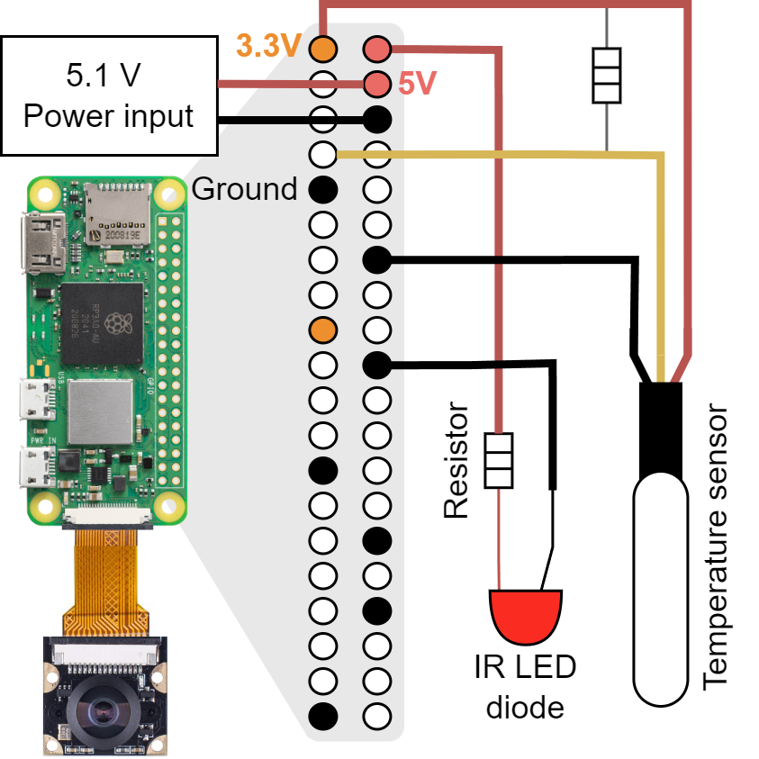
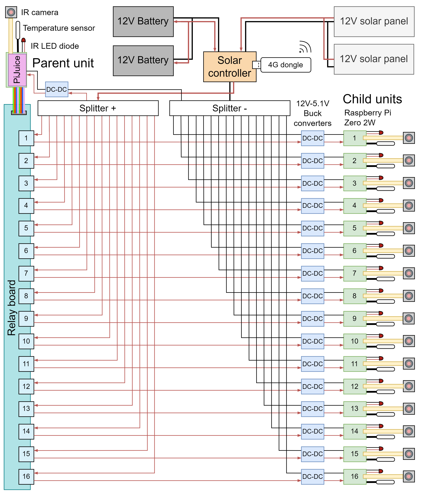

# Design of an automated, centralized, multi-unit monitoring system using Raspberry Pi

Here we provide detailed guidelines to set-up both the hardware and the software of our centralized, multiple-unit, off-grid monitoring system. We provide a shopping list, guidelines to ensamble the electronics and explain in detail how to configure system software for task automation, allowing broad customization. 

## Hardware list
Provide shopping list with all the materials needed.
Before getting into the electronics, there are some starting materials and tools that will always be useful when working with Open Electroincs. Consider the need of the following equipment based on your project requirements:

- Soldering iron kit
- Helping hand
- Electrical tape
- Touch screen for the Raspberry Pi
- Official Raspberry Pi charger
- USB-microUSB adapter
- HDMI-microHDMI adapter
- SD card-USB adapter
- Keyboard and mouse
- Jumper wires and breadboard 
- Electrical wires (22AWG)
- Heat shrink sleeves
- Multi-meter

#### Parent unit
- Raspberry Pi 4B+ 8GB RAM
- Raspberry Pi Case
- Heat sinks
- SD card (128 GB)
- PiJuice HAT + built-in battery
- Raspberry Pi Camera
- IR LED diode
- DS18B20 temperature sensor
- Resistor kit

There are various models of Raspberry Pi with many different characteristics (RAM, WiFi hotspot, Bluetooth, ...). We selected the Raspberry Pi 4B+ model for the parent unit to compensate the increments in computing resource usage due to system coordination tasks. Nevertheless, Raspberry Pi Zero 2W can also be used as a parent if the monitoring tasks aren't that resource consuming (e.g., don't need to create a web server for real-time system performance monitoring). PiJuice Zero is also available to work on the Raspberry Pi Zero 2W.
Regarding the camera, many different models can be connected to the Raspberry Pi, from very small wide angle lenses to HQ cameras and even DSLR cameras. Infrared LED is used to provide standard light conditions during darker situations. Many LED diodes exists, but we selected an IR 940nm as it appears to be invisible for birds, as we were installing them in artificial nest boxes. However, in other projects where the visibility of the light would not compromise the study (birds appear to see light below 860nm), other LED might be preferred instead of IR light for a better image quality.

#### Child units
- Raspberry Pi Zero 2W
- 40-pin header 2x20 GPIO (if the Raspberry Pi does not include GPIO pins already)
- Raspberry Pi case
- Heat sinks
- SD card (128 GB)
- Raspberry Pi Camera
- IR LED diode
- DS18B20 temperature sensor
- Resistor kit

#### Solar powering system

- 12V Solar panels (a single one or multiple connected in parallel)
- 12V AGM batteries (a single one or multiple connected in parallel)
- 12V Solar controller 
- 12AWG wires

There are several categories of lead-acid batteries, including flooded, gel, and absorbent glass mat (AGM). AGM is the newest of the three and the best suited for solar applications because of its zero-to-low maintenance and deep discharge cycle. Monocrystalline solar panels are the best type of solar panel in terms of efficiency. Their ability to capture sunlight is higher than both polycrystalline panels and thin-film solar panels. Regarding the solar charge controller, there are two primary types: Pulse Width Modulation (PWM) and Maximum Power Point Tracking (MPPT) controllers. MPPT is a newer technology that harvests more energy, but the advantages of MPPT over PWM controllers come at a cost. Specially in smaller systems and in warm climates where MPPT boos is not as significant, a less expensive PWM controller can be the right choice.
Our system is composed by a 180Ah 12V AGM battery (100Ah + 80Ah in parallel), charged by 290W 12V monocrystalline solar panels (190W + 100W in parallel) and controlled by a EPEVER PWM VS3024AU 30A solar charge controller.

#### Hardware for system centralization

- Relay board (16 channel)
- Wire splitters
- 22AWG wire
- Buck converters
- 4G HUAWEI E8372h-320 dongle
- SIM card with 4G connection

The load of the solar controller was split in sixteen to route the positive wire through each of the relay channels. Every output of the relay was then connected to a LM2596 buck converter to provide the correct 5.1V input for the RPi’s instead of the 12V coming from the battery. We used 12AWG wires for the solar system (for the solar panels, solar controller and batteries) and 22AWG wires for all the connections coming from the solar controller load to the RPi. 

### Calculations of solar power, storage capacity and budget
We provide Excel files with formulas to calculate the power consumption and storage capacity needed for such a system. Together with a detailed list of expenses for the budget, these calculator files can be found in the [Calculations](Calculations) section.

## Setting up electronics
### Core unit
Some of the used electronics may need to be manually iron-soldered before being used, such as the GPIO pins to the Raspberry Pi board or resistors to the LED and temperature sensor.
In our system we connected the electronics in the following way for each (both parent and child):

  

  <em>Connections schematics of a single unit, powering the Raspberry Pi Zero 2W using the GPIO pins. Red pins provide 5V but can also be used as a power input, orange pins provide 3.3V and black pins ground. A 4.7kΩ pull-up resistor is used for the temperature sensor and a 120Ω resistor for the IR LED diode.</em>

Additionally, the parent unit included a PiJuice HAT, where all these electronics where connected to using their pins.

### Centralized multiple-unit system with a Relay board
In order to control the multiple child units, the parent unit controlled each of the relay channels from a unique GPIO pin. Hence, using jumping wires we connected the relay board to the parent unit, also being powered by the relay board input itself.

  

  <em>Connections schematics to use multiple Raspberry Pi micro-computers in a parent-children system using a relay board. Each Relay channel is controlled by one single GPIO pin from the parent Raspberry Pi. Providing power to the GPIO pin, closes the relay channel, allowing the power flow from the battery to the child unit. When cutting power to the GPIO pin, the relay channel cuts the current to the child unit.</em>

## First steps with the Raspberry Pi
### Install Raspbian OS
For setting up the Raspberry Pi, installing the OS in the SD card and understanding the basics, see the wonderful *[Raspberry Pi guide by Jolle W. Jolles](https://raspberrypi-guide.github.io/)*. These guides should help to get you started with your Raspberry Pi, including selecting the right hardware, installing the operating system, and configuring the Raspberry Pi.

### Software installation for easier connectivity
For an easier file transfer, cloud storage services such as Google Drive or One Drive can directly be mounted to the Raspberry Pi using RClone. Guidelines on how to install RClone and mount your cloud service to the Raspberry Pi can easily be found online. 

Cluster SSH tools are useful to control all child units at the same time with simultaneous command executions from the parent RPi, efficiently centralising coordinated multi-unit operation. We used *clusterssh* package.

### Software for monitoring
All the data collection is run in python and bash scripts, but mainly python. For image-based data, we use *[Pirecorder](https://jollejolles.github.io/pirecorder/)* as the recording software in our system, offering wide customization and advanced functionalities for many applications. However, note that Pirecorder should be run under Raspbian Buster OS, while being unable to run under Bullseye and Bookworm newer OS. Guidelines of software installation can be found in Pirecorder documentation. Additional software requirements should be installed using the terminal, such as *OpenCV* and *ffmpeg*.
*Pirecorder* offers a versatile platform for customizing camera settings, recording parameters, and scheduling recordings. In applications requiring long, continuous recording periods, using image or video sequences instead of long videos minimizes the risk of data loss in the event of unexpected shutdowns and allows for uninterrupted data collection over long periods. For instance, images can be captured at sizes as small as a few kilobytes each, managing storage use effectively. These sequences can later be converted into a single video file using customizable compression settings via the ffmpeg-python package, deleting the raw sequence files to free storage use afterwards. By automatically uploading and cleaning up data, the system can operate long-term without running out of space on the SD card.

By a series of scripts and commands, the system can run completely autonomously, turn on and off when desired, and perform a series of tasks at predetermined intervals. In most cases we may want to program a daily routine, such as powering on, collecting data, performing necessary conversions, backing up files, and then powering off at specific times. Such automation of the RPi’s can be easily managed through bash and Python scripts, that can be triggered at fixed times, dates, or intervals using utilities like *cron* or at startup or shutdown. The package *python-crontab* allows modifying the cron jobs using python scripts.

### Real-time system performance monitoring

Continuous performance monitoring ensures that all units function optimally and any issues are detected quickly. Each monitoring unit can share its real-time status with a central platform, allowing researchers to check important operational data, such as CPU load, available storage, sensor functionality, and network connectivity. Various options exist for enabling such up-time and performance monitoring, the most versatile of which is a local webserver that provides a centralized view of the status of all devices, which can be accessed from any web browser. In practice, the parent RPi hosts a local web server that collects and displays performance data from itself and all child units, which are sending data at standard intervals (e.g., every 5 seconds) to the parent via the local network. To enable the information to be shared on the internet remotely, a gateway service such as Ngrok can be used to publish the local web server to the internet, enabling real-time monitoring from any location. Yet, all performance monitoring is continuously stored in a logfile, allowing to check from errors in the past even if the system do not use internet connection.

Advanced preps: flask, ngrok, ... for web-server development

## Software for system replication

Python-based. Explain the config.py script and its functionality to automatically personalize the system.
List all the scripts, provide directory structure needed and briefly explain what each script does, how to customize them and what config-files have to be modified to use them (email, web server, etc).

