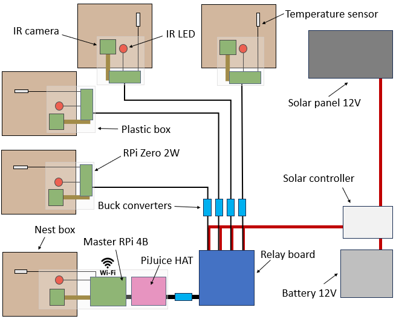

# Hardware for the design of an automated recording system

## Core unit
To collect continuous video and temperature data from the nest, we installed a camera, an infrared (IR) LED for night vision and a temperature sensor for constant environmental temperature monitoring. The system required high customization for recording schedules and configuration, low power consumption due to its installation off-grid, and cost-effectiveness to use multiple units in multiple nest boxes. To meet these requirements, all electronics were connected to a single-board computer, specifically the low-power consuming Raspberry Pi Zero 2W, running the Raspbian Buster operating system on a 128 GB micro-SD card. Raspberry Pi micro-computers have been increasingly used by ecologists, providing a highly affordable alternative to expensive research equipment (Jolles, 2021). Additionally, we used the PiJuice power management HAT, to automatically restart the Raspberry Pi via scheduled wake-up alarms. After a shutdown, the PiJuice HAT remains active in a low-power state using its built-in battery and will power the Raspberry Pi back on as scheduled, ensuring autonomous and continuous system operation (i.e. only need to monitor during daylight). 

As power efficiency was a critical factor, we selected the lowest power-consuming Raspberry Pi model but acknowledge that higher-power models may be suitable for other applications. Consider that alternative sensors can be utilized for different applications, and other single-board computer brands may also be suitable for similar setups. 

## Multiple unit assembly
To monitor multiple nests within one of these towers, we needed to install a core unit in each nest box and synchronize their operation to work as a unified system using minimal resources. We used a single "parent" unit that controls the power input of the other "child" units with a relay board, enabling synchronization of working schedules for all units. For the parent unit, we employed a more powerful Raspberry Pi 4B+ to handle the increased computational load required for coordinating the system. The parent Raspberry Pi controls an AZDelivery 16-channel relay board through its GPIO pins. Each relay channel functions as a switch that the parent Raspberry Pi can activate or deactivate. The positive wire supplying power to each child Raspberry Pi is routed through one of these relay channels, allowing the parent Raspberry Pi to control the power input to each child unit by bridging or cutting the connection as needed. This setup ensures that, once the parent Raspberry Pi is powered on, it can activate all relay channels, supplying power to the child Raspberry Pis and synchronizing their startup. Besides, only the parent unit used a PiJuice HAT, as once this unit is on it can already power on the child units.

## Solar powering system
To ensure fully continuous monitoring over a long time period we use a solar powered battery system. A EPEVER PWM VS3024AU 30 A solar charge controller is connected to 12V monocrystalline solar panels (190 W + 100 W in parallel), a 180 Ah 12 V AGM deep-cycle battery (100 Ah + 80 Ah in parallel) and a 12 V to 5 V DC step down converter which finally powers the Raspberry Pi.

### Power requirements calculation
The daily power consumption of the system was calculated using the formula (((Wha*na+Whb*nb)*t)/V)*1,2, where Wh refers to the power consumption of the RPi computer. If there are different models of RPi in the system, multiply the consumption for the number of RPis of each kind (n). t is the number of hours in a day that the system should be working with that power consumption and V is the voltage of the system. It’s a good practice to add the 20% to this calculation (*1,2) to consider power loss due to buck conversion and long wire length use, besides power dissipation during overheating periods. For example, with a system composed by 1 RPi 4B+ with a maximum power consumption of 6,4Wh and 13 RPi Zero 2W with a maximum power consumption of 2,2Wh working for 17h a day (from dawn to dusk) we would need a 12V battery with a size of at least 67Ah. 

The size of the solar system to power the electronics while charging the battery was calculated using the formula Ah*2*V/(h*e), where e refers to the solar panel efficiency and the daily power consumption (Ah) is multiplied by 2 to power the system while charging the battery during the sunny hours (h). Hence, for a system consuming 67Ah and the solar panels receiving 8h of sunlight a day with an efficiency of 70% we would need a 287W solar panel system. It’s also a good practice to increase the battery size to at least the double to keep the system working under continuous cloudy days (i.e. battery of at least 134Ah). The minimum amperage of the solar controller is calculated dividing the power of the solar panels by their voltage (i.e. 23,92A). Consider connecting extra batteries and/or solar panels in parallel to increase the size of the power supply if the system requires higher power consumption after the first installation. 

### Optimal power conservation
If 24-hour functionality is unnecessary, the system can be set to operate only during daylight hours to conserve battery at night. We operated the RPis from dawn to dusk to minimize power consumption when solar panels weren't charging. PiJuice HAT’s wake-up alarm powers on the parent RPi at dawn after having spent the night at a low power state. Seconds after its wake-up, the parent activates the relay board to power all the child units to start working synchronously. At dusk, all the RPi shutdown to save battery at night, waiting to be powered on again the next day. 

## Connectivity
A HUAWEI E8372h-320 mobile network dongle enabled internet connection to up to 16 devices. Remote access to the parent RPi was established via virtual network computing (VNC) software VNC Viewer. Upon establishing a remote connection to the parent RPi desktop, individual child RPis were controlled through Secure Shell (SSH) connections via the command line. To efficiently manage multiple devices, the cluster management tool ClusterSSH were employed to enable simultaneous SSH connections, allowing the execution of identical commands across all RPis with a single input. For remote file sharing, cloud storage services (e.g., Google Drive or OneDrive) were integrated into the RPi system by mounting the respective cloud drives. This setup provided a reliable means for file transfer and backup, enabling continuous sharing of data.