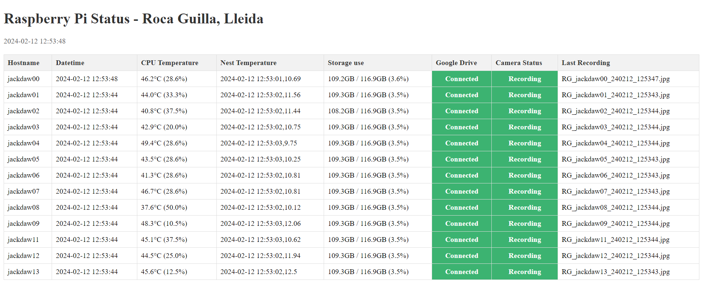

# Software for the design of an automated recording system

## Automated system operation
All the RPis were previously configured to follow the same routine every day: power on at dusk, start running some tasks to gather, convert and back-up the data at the desired schedules during the day and power off at dawn to save battery at night. All these tasks are shell and mainly python scripts that are run periodically at fixed times, dates, or intervals using cron command-line utility (i.e. run a script used to write reads from the temperature sensor to a csv file every 5 seconds). The daily routine is as follows. The parent RPi is programmed to wake up 2h before sunrise, using the PiJuice HAT’s wake-up alarm set at that specific time in advance. Once powered on, the parent RPi runs a python script that uses the relay channels to provide power to all children RPi, powering them on. After working for the whole day, the children RPi are programmed to safely shutdown 2h after sunset. Once the children are off already, the parent RPi cuts the power to the children using the relay board. Lastly, the parent RPi updates the PiJuice wake-up alarm based on the sunrise time from next day and shuts down itself to save battery at night. Next day, it will power on 2h before sunrise and follow the same routine. 

Seconds after turning on in the morning, all RPi automatically start collecting temperature data at scheduled times and recording an image sequence at 1fps using PiRecorder python package (Jolles, 2020). PiRecorder provides useful functionalities for customizing camera settings and recording parameters. Images were recorded in grayscale and low resolution to reduce storage use. Recording an image sequence instead of a video allows uninterrupted functioning for long period image data collection while reducing data loss risk at unexpected sudden computer shutdown. Besides, every recording will later be converted to a video file using custom parameters for compressing via ffmpeg-python package and saved in a folder containing all videos, allowing extra customization for compression than current recording software. After a successful video conversion, raw images are deleted to free storage space. Additionally, a Python script was developed to automate the daily monitoring of new recordings stored in the RPi's designated folder, uploading them to the cloud storage if they were not previously synchronized, together with temperature data and logging files. After a successful video conversion and uploading to the cloud, raw images and videos on the RPi were deleted to free up storage space. This data storing method allows long-term continuous operation, as the SD card will rarely be full.  

## Programming a continuous performance monitoring
Additionally, all RPi share their real-time status to a public web server to allow checking that they are working correctly from anywhere using a smartphone or a laptop. This allows to check the CPU usage and temperature, SD card free storage space left, recording status, cloud connection status, together with many other needed status data. When it powers on, the parent RPi creates a local web server using Flask API where it continuously uploads its performance status, while requesting the same information to the other children RPi and including it to the web if available. To allow public access to the web server from everywhere, the parent RPi publishes this local web server (only available through the local network where the computers are connected to) to the internet using Ngrok IoT device gateway software. At this moment, real-time monitoring of all the RPi units is possible from everywhere searching this website on the phone or laptop browser. 

Besides the real-time performance update to the web server, continuous performance checking can be run frequently to get instant notification via email of system malfunctioning and warnings. Performance monitoring was implemented in python, programmed to check possible system malfunctioning scenarios that were previously identified and translated into code (i.e. camera malfunction, data storage issues, almost full SD card warning…). 

