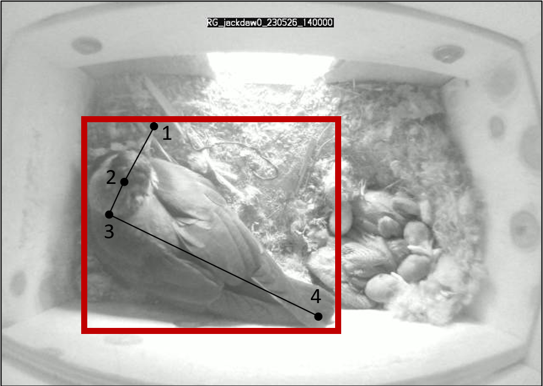
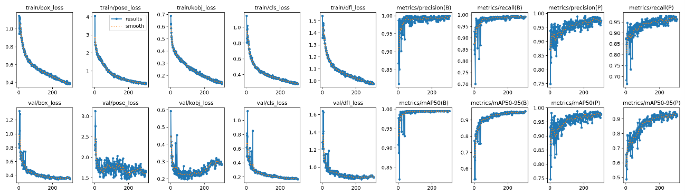

# Automated image analysis using a custom YOLOv8 computer vision model

A sample of 50 videos from every nest box was selected to extract a random sample of 200 frames from each with a custom python script [extract_frames.py](extract_frames.py). We randomly selected videos using the script [select_videos.py](select_videos.py) from the nest construction period until the third week after egg hatching, excluding the period where chicks start growing feathers and looking like adults (excluding chick age >16 days). From all these images, we selected 1,800 frames with at least one bird in them, together with 200 images showing only background (representing the 10% of the training set). All these images form a representative sample of all birds in multiple body positions under all possible light conditions, under multiple possible backgrounds of nest material. We manually annotated all images using Computer Vision Annotation Tool (https://www.cvat.ai/). CVAT is an easy-to-use, interactive video and image annotation tool for computer vision that can be used online for free. For every bird detected in the images, we annotated a bounding box around it (for object detection) and key points to mark the tip of the beak, the head, the neck, and the tip of the tail (when visible, for pose estimation). In cases where not all key points where visible in the image (e.g., the bird is looking outside, only showing the tail), non-visible key points were annotated at coordinate 0,0 of the image for filtering purposes afterwards. Key points were always annotated in the same order (from beak to tail) and following the same order as bounding box annotations when multiple individuals were detected in the same image (allowing to relate each detection with its corresponding key points, avoiding confusion across different individuals).

  

  <em>Image annotation for object detection and pose estimation in a sample image. Red bounding box is used for object detection (a jackdaw) and points (1 for beak, 2 for head, 3 for neck and 4 for tail) are used for pose estimation.</em>

A total of 6,514 birds were manually annotated in all 2,000 images used for training. Image annotations must be saved in individual *.txt* files with the same filenames for correct reading when training YOLOv8 (see example with this [image](RG_230314_jackdaw0_frame13198.jpg) and its [annotation](RG_230314_jackdaw0_frame13198.txt). Hence, annotations were exported in the CVAT format *.xml* and further transformed to the correct YOLOv8 format using a custom python script [CVAT_to_YOLOv8_annotation.py](annotation_CVAT_to_YOLOv8.py), accounting for key point visibility. Extensive documentation can be found in the Ultralytics/YOLOv8 website (https://docs.ultralytics.com/). Using the annotated set of images and its annotations, we trained the YOLOv8m-pose model for 300 epoch, maintaining an optimal balance between accuracy and speed compared with the bigger available models YOLOv8l and YOLOv8x. 

# Model performance metrics and validation

Model performance metrics for object detection (B) and pose estimation (P) proof a high accuracy, given that a relatively small training sample was used compared to existing detection models for other purposes (e.g., detect moving vehicles in highways). For object detection, the average of the mean average precision calculated at varying intersection over union thresholds (*mAP50-95(B)*) was 0.956, *Precision(B)* was 0.999 and *recall(B)* was 0.992. For pose estimation, *mAP50-95(P)* was 0.927, *Precision(P)* was 0.975 and *recall(P)* was 0.963.

  

  <em>Custom YOLOv8 model performance metrics for object detection (B) and pose estimation (P).</em>

To test the reliability of the detections, we manually watched the inferred videos to identify scenarios where the model wasn’t performing as expected (e.g., under low light conditions some detections were missed, or false detections were generated). Using *RStudio*, we solved some errors in the detections that we could manually detect watching the videos. For example, we interpolated missed detections that happened in very short periods of time, cloning in those frames the detection in the last correct frame (e.g., in cases where a single detection in a frame was missed between continuous frames where the detections were correct, or filtering out detections that last for very short time). Once the first corrections were applied, we randomly selected multiple one-minute periods from less reliable scenarios and manually annotated the frames where a false or a missed detection occurred. After testing performance in a total of 10 hours of recording under less confident scenarios, we calculated the proportion of false and missed detections against the correct ones. This validation conducted after running inference and post processing detections showed a proportion of false detections of X, together with a proportion of missed detections of X. This suggests that the detections are highly accurate, with minimal and non-significant errors. 