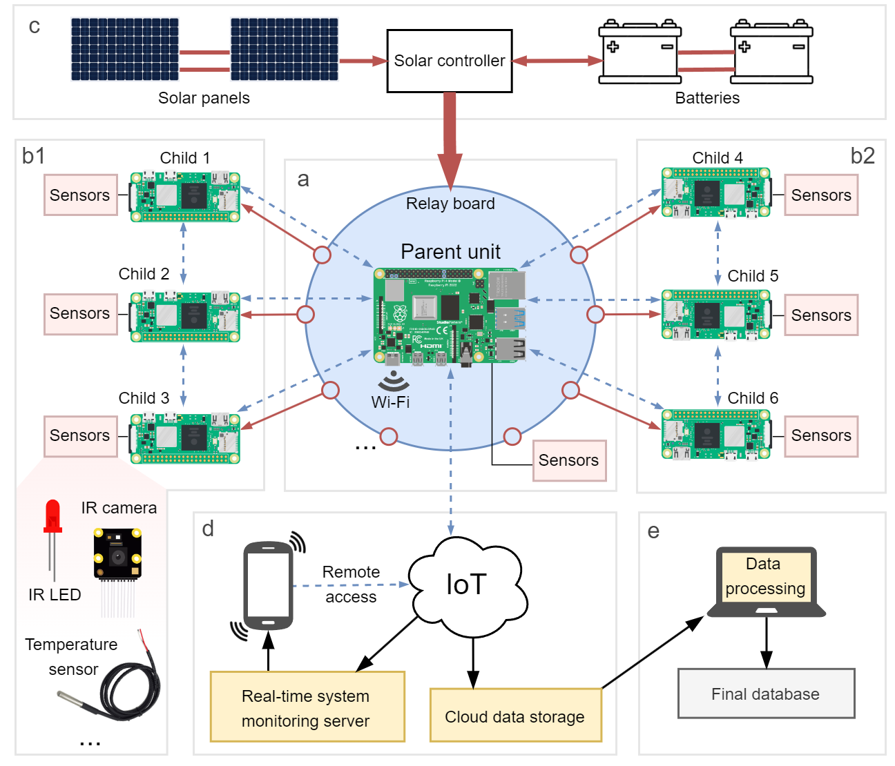

# A centralized multi-unit recording system for automated, off-grid environmental monitoring and animal surveillance
Ecological and behavioural field research on natural populations often relies on continuous, simultaneous monitoring of many samples or individuals over extended periods of time. However, efficiently collecting, storing and extracting large amounts of data in a non-invasive way poses significant logistical challenges, especially in remote, hard-to-access areas. Furthermore, it is often difficult to properly synchronise and coordinate the monitoring of multiple monitoring locations.

Here, we present a flexible, multi-unit video monitoring system based on Raspberry Pi microcomputers to overcome these challenges. Our system uniquely uses central control for both autonomous data collection, synchronization, and storage across multiple child units and their optimal use of power. It relies on solar energy and battery power to operate in off-grid environments and supports remote connectivity and automated data transfer. Accommodating a wide range of sensors and configurations, it offers an adaptable, scalable solution for diverse research needs. 

We provide a pipeline for dealing with the large amount of data the system can generate, integrating open electronics with computer vision and deep learning. As a proof of concept, we describe the implementation of our system for detailed monitoring of parental care in a social bird species throughout the reproductive cycle. It enabled us to successfully collect continuous data on parental effort and coordination of breeding pairs over four months, alongside episodic data on nesting activities, predation events and social interactions with conspecifics.

  

  <em>Simplified schematic of the centralized multi-unit recording system, which consists of (a) the central parent Raspberry Pi unit and a relay board, (b) multiple child units with power control (red arrows) by the central unit via the relay board, and (c) the external power source, solar panels and/or batteries and associated power controller. Both the parent and child units can collect data using various sensors (e.g., video, temperature, sound). All units are synchronized from the parent unit and wireless connectivity (4G/Wi-Fi, indicated by blue dashed arrows) enabling real-time sharing of system updates and performance as well as data transfer, such as to cloud storage services and remote connection from a smartphone or laptop (d). When needed, large (image-based) datasets can be processed efficiently in an automated way using custom computer vision models (e).</em>

  

  
  

  <em>Artificial bird nesting tower with multiple nest boxes, equiped with solar panels and video-monitoring units in 14 nest boxes. This automated recording system allowed us to continuously monitor parental care of multiple jackdaws, from nest construction until fledging period.</em>

Open-source design and code, complemented by computer vision and deep learning guidelines for deriving custom inferences from large video datasets, make the proposed monitoring system accessible, cheap and versatile for addressing a wide range of ecological problems.

  

  <em>Custom computer vision model specifically trained to detect the jackdaws appearing in the collected images together with its posture. </em>

Our system enables continuous, non-intrusive monitoring of organisms and environments in the field in unprecedented detail. Its low-cost, open-source design, and high adaptability make it a versatile solution to a wide range of ecological problems, from long-term forest canopy dynamics to detailed animal behaviour monitoring. Detailed guidelines are provided for building, adjusting, and programming the system, and data processing, facilitating its use by non-experts.

This GitHub page accompanies the research paper Pou-Rossell et al. (2025) "**A centralized multi-unit recording system for automated, off-grid animal observation and environmental monitoring**", under review (but see preprint here: DOI).

## Project structure

This project is divided in 2 main parts:
1) Design of an automated recording system based on Raspberry Pi microcomputers, to continuously monitoring nest boxes in the wild for long time periods
1) Application of a custom computer vision model for automated video analysis in Python