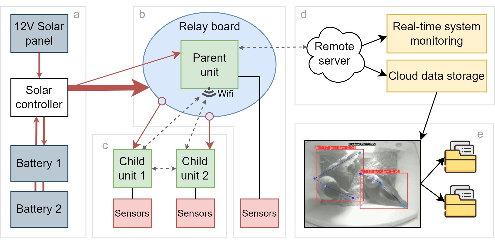
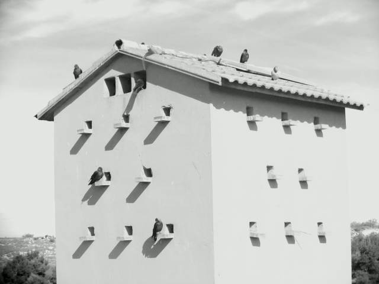
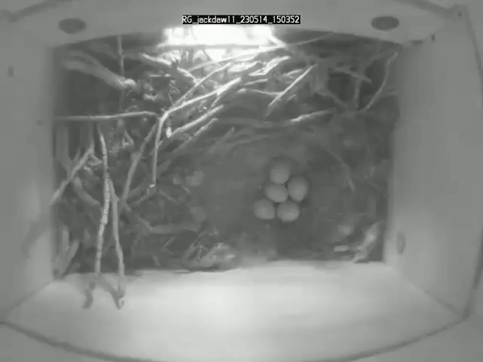
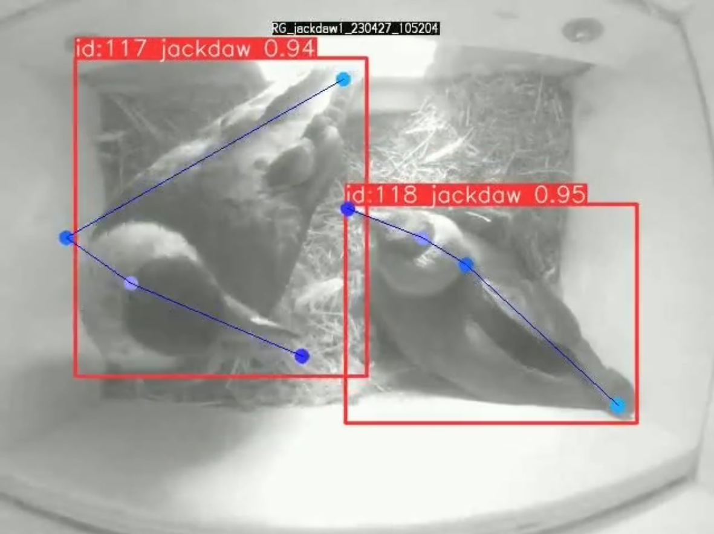

# A centralized multi-unit recording system for automated, off-grid environmental monitoring and animal surveillance

Behavioural and ecological research on wild populations largely relies on continuous and simultaneous observations of many individual sites for long periods. However, efficiently collecting, storing and extracting such data in a non-invasive way poses significant logistical challenges, especially in remote, hard-to-access areas.
Here, we present a flexible, multiple-unit video monitoring system based on Raspberry Pi micro-computers, which autonomously manages data collection, synchronization and storage across multiple child units under the coordination of a parent device. This setup is powered by solar energy, operating efficiently in off-grid environments, and supports remote connectivity and automated data backup. Designed to accommodate various sensor types and configurations, the system provides a robust, scalable solution adaptable to diverse field and laboratory research needs. The combination of open electronics with computer vision and deep learning techniques enables continuous and non-intrusive monitoring of animals in unprecedented detail.

  

As a proof of concept, we describe the implementation of a multiple-unit system to monitor parental care behaviour in social, monogamous bird throughout the entire reproductive cycle. The system collected continuous data on parental effort and coordination of individuals over a four-month period, in addition to episodic data on nesting activities, predation events and interactions with conspecifics.
We provide full design guides for setting up electronics and include open-source code for customizing the system operation.

  

  
  

Open-source design and code, complemented by computer vision and deep learning guidelines for deriving custom inferences from large video datasets, make the proposed monitoring system accessible, cheap and versatile for addressing a wide range of ecological problems.

  

We provide a low-cost, scalable solution for automated continuous behavioural monitoring. The flexibility of our system allows for broad customization, both in hardware and software, enabling its adaptation for a wide range of behavioural studies. The modular design allows the integration of additional sensors, while the system’s remote connectivity and solar-powered configuration ensure functionality in remote, off-grid locations. 

## Project structure

This project is divided in 2 main parts:
1) Design of an automated recording system based on Raspberry Pi microcomputers, to continuously monitoring nest boxes in the wild for long time periods
1) Application of a custom computer vision model for automated video analysis in Python